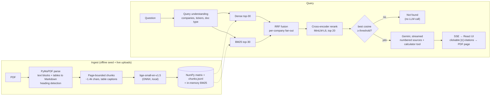

# FinSight: RAG copilot for annual reports

Ask questions across the latest SEC filings of **Infosys, Wipro, Cognizant and Accenture** (Form 20-F / 10-K annual
reports plus the most recent quarterly earnings releases, 937 pages in total). FinSight answers only from those
documents, cites every figure down to the page, does arithmetic with a calculator tool instead of guessing, and says
*"I couldn't find this"* when the filings don't contain the answer.

**Live demo:** https://finsight-ai-rag.vercel.app · **API:** https://finsight-api-production-1220.up.railway.app/api/health

## What makes it more than "chat with a PDF"

| Problem with real filings | What FinSight does |
|---|---|
| Financial statements are mostly **tables** | Layout-aware parsing (PyMuPDF): tables are extracted whole as Markdown, prefixed with their caption, split by rows (header repeated) only when too long. Chunks never cross a page, so every citation is exact. |
| Exact tokens matter ("20-F", "Q1", "TCV", "$5,082") | **Hybrid retrieval**: dense vectors (bge-small) + BM25, merged with Reciprocal Rank Fusion. |
| Top-k is noisy | **Cross-encoder reranker** (MiniLM) rescores the top 20 candidates. |
| "Compare Infosys and Wipro…" returns only one company | **Query understanding** detects companies/tickers and fans retrieval out per company, with an equal share of context slots for each. |
| LLMs fumble arithmetic | Gemini **function calling** into a sandboxed calculator (AST-parsed, no `eval`). |
| Hallucinated answers to off-topic questions | **Relevance gate** (no LLM call when nothing retrieved is close) + a strict grounding prompt with a fixed refusal string. |
| "Is it actually good?" | A **labelled evaluation set** (51 questions tied to gold pages + 12 unanswerable) with a retrieval ablation and end-to-end answer scoring, shown in the app's *Evaluation* tab. |

## Results

Retrieval ablation on 51 labelled questions (937 pages, 3,168 chunks):

| Configuration | Recall@5 | Recall@8 | MRR | Median latency |
|---|---|---|---|---|
| BM25 only | 0.598 | 0.726 | 0.532 | 16 ms |
| Dense only | 0.726 | 0.804 | 0.590 | 17 ms |
| Hybrid (RRF) | 0.833 | 0.873 | 0.650 | 15 ms |
| Hybrid + query filters | 0.833 | 0.922 | 0.632 | 16 ms |
| Hybrid + filters + rerank | 0.853 | 0.961 | 0.683 | 3132 ms |

End-to-end with `gemini-flash-lite-latest` (63 questions, including 12 unanswerable):

| Metric | Result |
|---|---|
| Answer contains the exact expected figure | **96.1%** |
| A cited page prints the expected figure | **94.1%** |
| Cited one of the hand-labelled gold pages | 90.2% |
| Refuses unanswerable questions | **100%** |
| False refusals on answerable questions | 2.0% |
| Average end-to-end latency | 4.7 s |

Findings:

- Each retrieval stage adds recall: BM25 0.73 -> dense 0.80 -> hybrid RRF 0.87 -> + company filters 0.92 -> + cross-encoder rerank 0.96 (Recall@8).
- Hybrid beats either retriever alone by ~7-11 points of Recall@5: BM25 catches exact tokens (tickers, 'TCV', figures), dense catches paraphrases.
- Company filters matter most for comparison questions: without per-company fan-out the larger 20-F filings crowd out the other company.
- The reranker is the expensive stage (~3 s on a laptop CPU for a pool of 20). Pools of 8 or 12 were faster but lost the Recall@8 gain (0.92 vs 0.96), so the pool stays at 20.
- Relevance gate at cosine 0.62: blocks 5/12 unanswerable questions before any LLM call and 0/51 answerable ones; the grounded prompt refuses the rest.
- Telling the model that guidance/outlook is not an actual result raised refusal on unanswerable questions from 83% to 100% with no extra false refusals.
- Remaining misses: one balance-sheet table whose column headers were lost in PDF extraction, and one comparison where 'TCV of large deal wins' was not matched to 'large deal bookings'.
- Filings repeat key numbers on several pages, so 'cited a labelled gold page' (90%) understates citation quality; 94% of answers cite a page that prints the expected figure.

## Architecture



**Why no vector database?** 3.2k chunks × 384 dims is ~2.4 MB in float16; a single matrix product is sub-millisecond.
A vector DB would add a service to run and pay for with no measurable gain at this size. The `Index` class keeps the
same interface, so swapping in Qdrant/pgvector later is a local change.

**Why local embeddings instead of an embeddings API?** The Gemini free tier allows ~30k embedding tokens/minute, so
indexing 937 pages would take close to an hour, and every live upload would compete with it for quota. ONNX models via
`fastembed` run on the API server's CPU with no per-call cost; the LLM is only used to write the final answer.

## Project layout

```
backend/
  app/
    ingest/        parse.py (PDF → blocks/tables) · chunk.py · pipeline.py
    retrieval/     bm25.py · query.py (company/doc-type detection) · hybrid.py (RRF, fan-out, rerank)
    answer.py      prompt, streaming, calculator tool loop, citation extraction
    calc.py        safe arithmetic evaluator
    store.py       on-disk index (atomic saves), seed → volume bootstrap
    main.py        FastAPI: /api/ask (SSE), /api/search, /api/documents, uploads, /api/eval
  data/seed/       manifest.json, 8 source PDFs, prebuilt index
  eval/            questions.py (labels) · check_labels.py · run_eval.py · results.json
  scripts/         build_corpus.py (EDGAR → PDF) · build_index.py
  tests/           26 tests (models and LLM stubbed)
frontend/          React 19 + Vite + Tailwind v4: chat, sources/PDF panel, library + upload, evaluation
```

## Run it locally

```bash
# backend
cd backend
python -m venv .venv && . .venv/bin/activate   # Windows: .venv\Scripts\activate
pip install -r requirements-dev.txt
echo "GEMINI_API_KEY=your-key" > ../.env        # free key: https://aistudio.google.com/apikey
uvicorn app.main:app --reload                   # http://localhost:8000/api/health

# frontend (new terminal)
cd frontend
npm install
npm run dev                                     # http://localhost:5173 (talks to localhost:8000)
```

The prebuilt index ships in `backend/data/seed/index`, so nothing has to be embedded before the first question.

```bash
pytest                                  # unit + API tests (no network, no model downloads)
python -m eval.check_labels             # every expected figure really is on its gold page
python -m eval.run_eval                 # retrieval ablation (offline)
python -m eval.run_eval --answers       # + end-to-end answers via Gemini
python -m scripts.build_index           # rebuild the seed index from the PDFs
python -m scripts.build_corpus --chrome <path-to-chrome>   # re-download filings from EDGAR
```

## Configuration

| Variable | Default | Purpose |
|---|---|---|
| `GEMINI_API_KEY` | – | Required for answers |
| `FINSIGHT_CHAT_MODEL` | `gemini-flash-lite-latest` | Generation model |
| `FINSIGHT_RERANK` | `true` | Cross-encoder reranking |
| `FINSIGHT_ONNX_THREADS` | 2 | Threads per ONNX model; match the container's vCPUs |
| `FINSIGHT_MIN_SIMILARITY` | 0.62 | Relevance gate (cosine) |
| `FINSIGHT_TOP_K` / `FINSIGHT_CANDIDATE_K` | 8 / 30 | Passages sent to the LLM / candidates per retriever |
| `FINSIGHT_ADMIN_PASSWORD` | – | Enables PDF uploads (header `X-Admin-Password`) |
| `FINSIGHT_QUERIES_PER_HOUR` | 30 | Per-IP rate limit on `/api/ask` |
| `FINSIGHT_CORS_ORIGINS` | `*` | Comma-separated allowed origins |
| `FINSIGHT_DATA_DIR` | `backend/data/live` | Writable index + uploads (a volume in production) |

## Deployment

- **Backend:** the `backend/` Docker image on Railway (1 GB RAM, 2 vCPU). The ONNX models are baked into the image, so
  cold starts don't download anything. Secrets (`GEMINI_API_KEY`, `FINSIGHT_ADMIN_PASSWORD`, `FINSIGHT_CORS_ORIGINS`)
  live in Railway variables. Without a volume, uploaded PDFs last until the next redeploy; the seed corpus is part of the image.
  `scripts/deploy_space.py` deploys the same image to a Hugging Face Space instead.
- **Frontend:** Vite static build on Vercel (root directory `frontend`), connected to this repo: every push to `main`
  deploys production automatically. `VITE_API_BASE_URL` points at the backend.

## Production notes

- **Pin ONNX Runtime threads to the container's CPUs** (`FINSIGHT_ONNX_THREADS`, default 2). ONNX Runtime sizes its pool
  from the host's core count; on a 2-vCPU container on a many-core host that meant dozens of threads contending, which
  made reranking take 12-16 s and pushed memory to 0.9 of 1 GB (the container was OOM-killed). Pinned: about 1 s and 0.43 GB.
- Retrieval skips the reranker when the relevance gate is going to refuse anyway.
- Answers take 2-3 s end to end. On the Gemini free tier, bursts of questions hit per-minute limits; the client honours
  the `retryDelay` in the 429 before streaming starts, so a burst costs latency rather than errors.

## Limitations

- Single-turn: each question is retrieved independently; follow-ups like "and Wipro?" need the full question.
- Fiscal years differ (Infosys/Wipro end in March, Accenture in August, Cognizant in December). The model is told to
  flag this, but "latest year" comparisons are only as aligned as the filings are.
- Tables printed from HTML have no ruling lines, so some are extracted as line-per-row text rather than Markdown
  tables; row structure is kept either way.

## Data

All seed documents are public filings from [SEC EDGAR](https://www.sec.gov/edgar), converted to PDF for page-level
citation. Source URLs are listed in `backend/data/seed/manifest.json` and shown in the app's Library tab.
