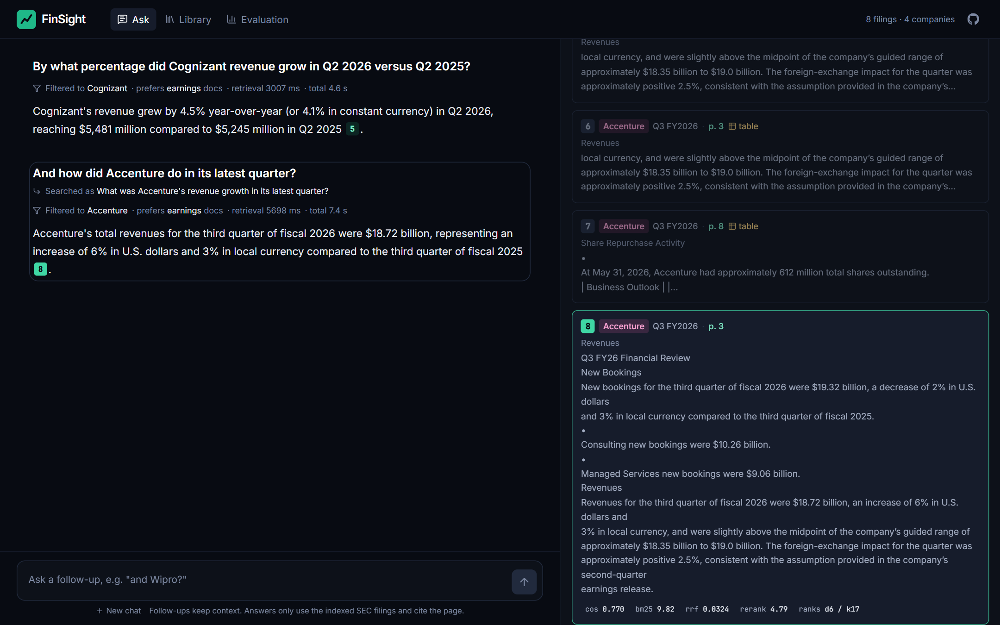
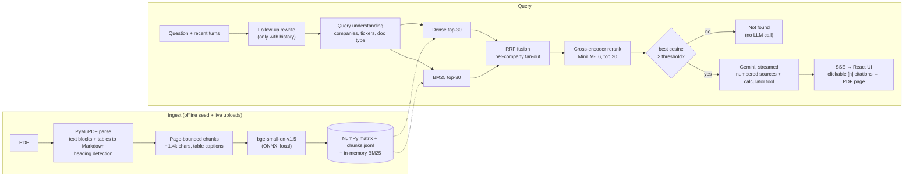
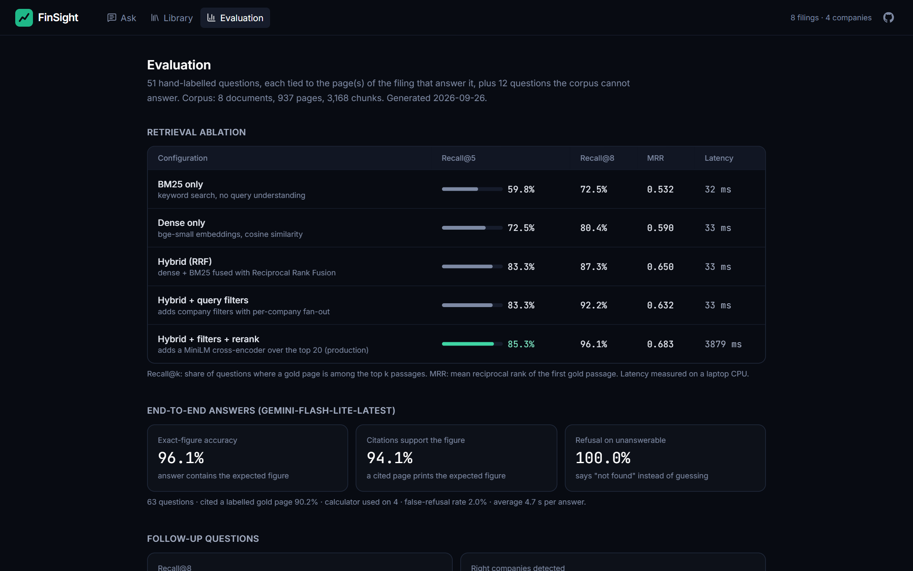
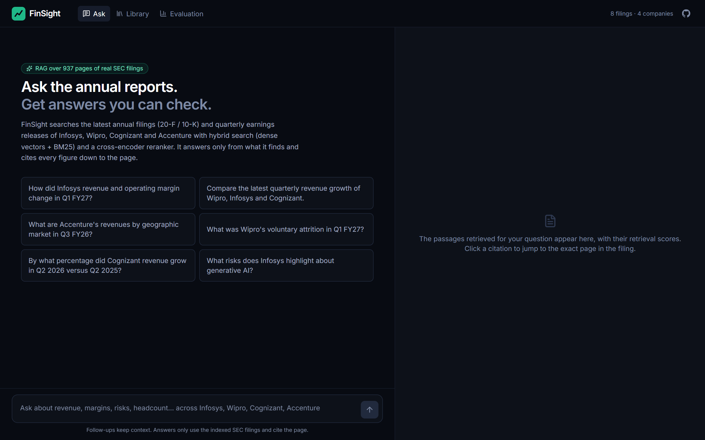

# FinSight: RAG copilot for annual reports

[](https://github.com/rahuldabola/finsight-rag/actions/workflows/ci.yml)
[](https://finsight-ai-rag.vercel.app)


[](https://github.com/rahuldabola/finsight-rag/actions/workflows/live-smoke.yml)
[](LICENSE)

Ask questions across the latest SEC filings of **Infosys, Wipro, Cognizant and Accenture** (Form 20-F / 10-K annual
reports plus the most recent quarterly earnings releases, 937 pages in total). FinSight answers only from those
documents, cites every figure down to the page, does arithmetic with a calculator tool instead of guessing, and says
*"I couldn't find this"* when the filings don't contain the answer.

**Live demo:** https://finsight-ai-rag.vercel.app · **API:** https://finsight-api-production-1220.up.railway.app/api/health



<sub>Click any <code>[n]</code> citation to see the passage, its retrieval scores (cosine, BM25, RRF, rerank) and the PDF page it came from.
A follow-up ("And how did Accenture do in its latest quarter?") is rewritten with the conversation before retrieval.</sub>

## What makes it more than "chat with a PDF"

| Problem with real filings | What FinSight does |
|---|---|
| Financial statements are mostly **tables** | Layout-aware parsing (PyMuPDF): tables are extracted whole as Markdown, prefixed with their caption, split by rows (header repeated) only when too long. Chunks never cross a page, so every citation is exact. |
| Exact tokens matter ("20-F", "Q1", "TCV", "$5,082") | **Hybrid retrieval**: dense vectors (bge-small) + BM25, merged with Reciprocal Rank Fusion. |
| Top-k is noisy | **Cross-encoder reranker** (MiniLM) rescores the top 20 candidates. |
| "Compare Infosys and Wipro…" returns only one company | **Query understanding** detects companies/tickers and fans retrieval out per company, with an equal share of context slots for each. |
| LLMs fumble arithmetic | Gemini **function calling** into a sandboxed calculator (AST-parsed, no `eval`). |
| Hallucinated answers to off-topic questions | **Relevance gate** (no LLM call when nothing retrieved is close) + a strict grounding prompt with a fixed refusal string. |
| Follow-ups ("and Wipro?") carry no company or metric | **Conversational query rewriting**: the last turns are condensed into a standalone question before retrieval (Recall@8 on ambiguous follow-ups 0.25 → 0.96). |
| "Is it actually good?" | A **labelled evaluation set** (51 questions tied to gold pages + 12 unanswerable) with a retrieval ablation and end-to-end answer scoring, shown in the app's *Evaluation* tab. |

## Results

Retrieval ablation on 51 labelled questions (937 pages, 3,168 chunks):

| Configuration | Recall@5 | Recall@8 | MRR | Median latency |
|---|---|---|---|---|
| BM25 only | 0.598 | 0.726 | 0.532 | 32 ms |
| Dense only | 0.726 | 0.804 | 0.590 | 33 ms |
| Hybrid (RRF) | 0.833 | 0.873 | 0.650 | 33 ms |
| Hybrid + query filters | 0.833 | 0.922 | 0.632 | 33 ms |
| Hybrid + filters + rerank | 0.853 | 0.961 | 0.683 | 3879 ms |

End-to-end with `gemini-flash-lite-latest` (63 questions, including 12 unanswerable):

| Metric | Result |
|---|---|
| Answer contains the exact expected figure | **96.1%** |
| A cited page prints the expected figure | **94.1%** |
| Cited one of the hand-labelled gold pages | 90.2% |
| Refuses unanswerable questions | **100%** |
| False refusals on answerable questions | 2.0% |
| Average end-to-end latency | 4.7 s |

Follow-up questions (12 ambiguous follow-ups, each after an earlier turn, e.g. "And Cognizant at the end of 2025?",
"What was diluted EPS in that quarter?", "Same question for Cognizant."):

| | Searched as typed | Rewritten with the conversation |
|---|---|---|
| Recall@8 | 0.25 | **0.96** |
| Right companies detected | 17% | **100%** |

Latencies are from a laptop CPU; in production (2 vCPU, ONNX threads pinned) reranking takes about 1 s.

Findings:

- Each retrieval stage adds recall: BM25 0.73 -> dense 0.80 -> hybrid RRF 0.87 -> + company filters 0.92 -> + cross-encoder rerank 0.96 (Recall@8).
- Hybrid beats either retriever alone by ~7-11 points of Recall@5: BM25 catches exact tokens (tickers, 'TCV', figures), dense catches paraphrases.
- Company filters matter most for comparison questions: without per-company fan-out the larger 20-F filings crowd out the other company.
- The reranker is the expensive stage (~3 s on a laptop CPU for a pool of 20). Pools of 8 or 12 were faster but lost the Recall@8 gain (0.92 vs 0.96), so the pool stays at 20.
- Relevance gate at cosine 0.62: blocks 5/12 unanswerable questions before any LLM call and 0/51 answerable ones; the grounded prompt refuses the rest.
- Telling the model that guidance/outlook is not an actual result raised refusal on unanswerable questions from 83% to 100% with no extra false refusals.
- Remaining misses: one balance-sheet table whose column headers were lost in PDF extraction, and one comparison where 'TCV of large deal wins' was not matched to 'large deal bookings'.
- Follow-ups are rewritten into standalone questions (one extra `gemini-flash-lite` call, only when there is history), so
  company filters and the grounding prompt work unchanged. The one remaining miss asked for Wipro's headcount "for the
  same period" (June 2026) while the label is the annual figure.
- Filings repeat key numbers on several pages, so 'cited a labelled gold page' (90%) understates citation quality; 94% of answers cite a page that prints the expected figure.

## Architecture


```mermaid
flowchart LR
    subgraph Ingest["Ingest (offline seed + live uploads)"]
        PDF[PDF] --> Parse["PyMuPDF parse<br/>text blocks + tables to Markdown<br/>heading detection"]
        Parse --> Chunk["Page-bounded chunks<br/>~1.4k chars, table captions"]
        Chunk --> Emb["bge-small-en-v1.5<br/>(ONNX, local)"]
        Emb --> Store[("NumPy matrix + chunks.jsonl<br/>+ in-memory BM25")]
    end
    subgraph Query
        Q[Question + recent turns] --> RW["Follow-up rewrite<br/>(only with history)"]
        RW --> QU["Query understanding<br/>companies, tickers, doc type"]
        QU --> Dense[Dense top-30] & BM25[BM25 top-30]
        Store -.-> Dense & BM25
        Dense & BM25 --> RRF["RRF fusion<br/>per-company fan-out"]
        RRF --> RR["Cross-encoder rerank<br/>MiniLM-L6, top 20"]
        RR --> Gate{"best cosine<br/>≥ threshold?"}
        Gate -- no --> NF["Not found<br/>(no LLM call)"]
        Gate -- yes --> LLM["Gemini, streamed<br/>numbered sources + calculator tool"]
        LLM --> UI["SSE → React UI<br/>clickable [n] citations → PDF page"]
    end
```

**Why no vector database?** 3.2k chunks × 384 dims is ~2.4 MB in float16; a single matrix product is sub-millisecond.
A vector DB would add a service to run and pay for with no measurable gain at this size. The `Index` class keeps the
same interface, so swapping in Qdrant/pgvector later is a local change.

**Why local embeddings instead of an embeddings API?** The Gemini free tier allows ~30k embedding tokens/minute, so
indexing 937 pages would take close to an hour, and every live upload would compete with it for quota. ONNX models via
`fastembed` run on the API server's CPU with no per-call cost; the LLM is only used to write the final answer.

## Project layout

```
backend/
  app/
    ingest/        parse.py (PDF → blocks/tables) · chunk.py · pipeline.py
    retrieval/     bm25.py · query.py (company/doc-type detection) · hybrid.py (RRF, fan-out, rerank)
    answer.py      follow-up rewrite, prompt, streaming, calculator tool loop, citation extraction
    calc.py        safe arithmetic evaluator
    store.py       on-disk index (atomic saves), seed → volume bootstrap
    main.py        FastAPI: /api/ask (SSE), /api/search, /api/documents, uploads, /api/eval
  data/seed/       manifest.json, 8 source PDFs, prebuilt index
  eval/            questions.py (labels + follow-ups) · check_labels.py · run_eval.py · results.json
  scripts/         build_corpus.py (EDGAR → PDF) · build_index.py
  eval/regression.py   CI gate: Recall@8 must not fall below the published baseline
  tests/           62 tests, 93% coverage (models and LLM stubbed)
frontend/          React 19 + Vite + Tailwind v4: chat, sources/PDF panel, library + upload, evaluation (25 Vitest tests, 10 Playwright browser tests in `e2e/`, desktop and mobile)
docs/              screenshots
.github/workflows/ CI: lint, tests, eval-label check, frontend build
```

## Run it locally

```bash
# backend
cd backend
python -m venv .venv && . .venv/bin/activate   # Windows: .venv\Scripts\activate
pip install -r requirements-dev.txt
echo "GEMINI_API_KEY=your-key" > ../.env        # free key: https://aistudio.google.com/apikey
uvicorn app.main:app --reload                   # http://localhost:8000/api/health

# frontend (new terminal)
cd frontend
npm install
npm run dev                                     # http://localhost:5173 (talks to localhost:8000)
```

The prebuilt index ships in `backend/data/seed/index`, so nothing has to be embedded before the first question.

Or run the API in Docker (same image as production): `GEMINI_API_KEY=your-key docker compose up --build`, then use the frontend as above.

```bash
pytest                                  # 62 tests + 85% coverage floor (no network, no model downloads)
mypy app                                # type check
python -m eval.regression               # CI gate: real embeddings, Recall@8 above the published floor
(cd ../frontend && npm test && npm run test:e2e)   # unit tests + browser tests (first time: npx playwright install chromium)
python -m eval.check_labels             # every expected figure really is on its gold page
python -m eval.run_eval                 # retrieval ablation (offline)
python -m eval.run_eval --answers       # + end-to-end answers via Gemini
python -m eval.run_eval --followups     # + follow-up rewriting via Gemini
python -m scripts.build_index           # rebuild the seed index from the PDFs
python -m scripts.build_corpus --chrome <path-to-chrome>   # re-download filings from EDGAR
```

## Configuration

| Variable | Default | Purpose |
|---|---|---|
| `GEMINI_API_KEY` | – | Required for answers |
| `FINSIGHT_CHAT_MODEL` | `gemini-flash-lite-latest` | Generation model |
| `FINSIGHT_RERANK` | `true` | Cross-encoder reranking |
| `FINSIGHT_ONNX_THREADS` | 2 | Threads per ONNX model; match the container's vCPUs |
| `FINSIGHT_MIN_SIMILARITY` | 0.62 | Relevance gate (cosine) |
| `FINSIGHT_TOP_K` / `FINSIGHT_CANDIDATE_K` | 8 / 30 | Passages sent to the LLM / candidates per retriever |
| `FINSIGHT_ADMIN_PASSWORD` | – | Enables PDF uploads (header `X-Admin-Password`) |
| `FINSIGHT_QUERIES_PER_HOUR` | 30 | Per-IP rate limit on `/api/ask` |
| `FINSIGHT_CORS_ORIGINS` | `*` | Comma-separated allowed origins |
| `FINSIGHT_DATA_DIR` | `backend/data/live` | Writable index + uploads (a volume in production) |

## API

| Endpoint | Purpose |
|---|---|
| `POST /api/ask` | `{"question", "history": [{"question", "answer"}]}` → Server-Sent Events: `rewrite`, `analysis`, `sources`, `token`, `tool`, `done` |
| `POST /api/search` | Retrieval only (no LLM), with `mode` (`hybrid`/`dense`/`bm25`), `rerank`, `filters` switches |
| `GET /api/documents` · `GET /api/documents/{id}/pdf` | Indexed filings and their PDFs |
| `POST /api/documents` | Upload a PDF (needs `X-Admin-Password`); indexed in the background, poll `GET /api/jobs/{id}` |
| `GET /api/eval` | The published evaluation results |
| `GET /api/health` | Index size, model, and the deployed git commit |

```bash
curl -N https://finsight-api-production-1220.up.railway.app/api/ask -H 'Content-Type: application/json' \
  -d '{"question": "and Wipro?", "history": [{"question": "What was Infosys revenue in Q1 FY27?", "answer": "$5,082 million."}]}'
```

## Deployment

Every push to `main` goes through three independent pipelines:

| | Where | Trigger | Notes |
|---|---|---|---|
| **CI** | GitHub Actions | every push and PR | backend: `ruff`, `mypy`, `pytest` (coverage floor 85%), `eval.check_labels`; retrieval regression: real embeddings on the seed index, Recall@8 must stay at or above 0.85 (hybrid) / 0.90 (+ filters); frontend: `eslint`, `vitest`, `tsc` + `vite build`; e2e: Playwright (Chromium, desktop + mobile viewport) against the production build with the API mocked; docker: builds the production image with `docker compose`, waits for its healthcheck and queries it; API contract: backend and frontend tests share `contracts/ask-events.json` |
| **Backend** | Railway (1 GB RAM, 2 vCPU) | pushes that change `backend/**` | Docker build from `backend/`; health check on `/api/health` means a broken build never replaces the running one |
| **Frontend** | Vercel | every push | static build from `frontend/`; `VITE_API_BASE_URL` points at the backend |

- **Is the live demo healthy?** `live-smoke.yml` runs daily (and on demand): frontend reachable, `/api/health` reports the full
  corpus, real retrieval returns the Infosys Q1 revenue table. It makes no LLM call, so it uses no Gemini quota. Dependabot
  keeps Python, npm, Actions and Docker dependencies current.
- **Which version is live?** `GET /api/health` returns `"commit"`: the short git SHA for git-triggered deploys
  (`local` for a manual `railway up`).
- **Secrets** (`GEMINI_API_KEY`, `FINSIGHT_ADMIN_PASSWORD`, `FINSIGHT_CORS_ORIGINS`) live in Railway variables, never in the repo.
- **Models** (ONNX) are baked into the image, so cold starts don't download anything.
- **Uploads**: there is no volume, so uploaded PDFs last until the next deploy; the seed corpus is part of the image.
- **Manual deploy** (from the repo root, since the service's root directory is `/backend`): `railway up --service finsight-api`.
- **Alternative host**: `backend/scripts/deploy_space.py` deploys the same image to a Hugging Face Docker Space.

## Design decisions and trade-offs

| Decision | Alternative | Why this one |
|---|---|---|
| Page-bounded chunks | Fixed-size sliding windows across pages | A citation has to point at one page a reader can open. Cost: a passage that spans a page break is split. |
| Tables as whole Markdown units | Flatten tables to text | Numbers lose meaning without their row and column headers. Cost: very wide tables are split by rows with the header repeated. |
| Local ONNX embeddings and reranker | Hosted embedding API | No quota or per-call cost at ingest time, models baked into the image. Cost: ~1 s of CPU per rerank in production and a bigger image. |
| NumPy matrix, no vector DB | Qdrant / pgvector | 3.2k chunks multiply in under a millisecond; one fewer service. The `Index` interface isolates the swap. |
| Relevance gate before the LLM | Always call the LLM and let the prompt refuse | Saves a call and removes a hallucination path for off-topic questions. Cost: a fixed threshold (0.62) has to be re-calibrated if the corpus or embedding model changes (`results.json` stores the calibration). |
| Rewrite follow-ups into a standalone question | Pass the chat history to the answering model | Company filters and the grounding prompt keep working unchanged and retrieval stays single-turn. Cost: one extra small LLM call, only when there is history, and the answer is not conditioned on earlier answers. |
| Calculator tool for arithmetic | Trust the model | Growth rates are the most common derived figure and LLMs miss digits. The evaluator parses with `ast`, never `eval`. |
| Labelled eval set with gold pages and a CI floor | Spot-check by hand | Retrieval changes are judged by numbers, and a regression fails the build rather than being noticed in a demo. |

## Production notes

- **Pin ONNX Runtime threads to the container's CPUs** (`FINSIGHT_ONNX_THREADS`, default 2). ONNX Runtime sizes its pool
  from the host's core count; on a 2-vCPU container on a many-core host that meant dozens of threads contending, which
  made reranking take 12-16 s and pushed memory to 0.9 of 1 GB (the container was OOM-killed). Pinned: about 1 s and 0.43 GB.
- Retrieval skips the reranker when the relevance gate is going to refuse anyway.
- Answers take 2-3 s end to end. On the Gemini free tier, bursts of questions hit per-minute limits; the client honours
  the `retryDelay` in the 429 before streaming starts, so a burst costs latency rather than errors.

## Limitations

- Conversation memory is the last 3 turns, kept in the browser and used only to rewrite the question; the answer
  itself is grounded on the newly retrieved passages, not on earlier answers.
- Fiscal years differ (Infosys/Wipro end in March, Accenture in August, Cognizant in December). The model is told to
  flag this, but "latest year" comparisons are only as aligned as the filings are.
- Tables printed from HTML have no ruling lines, so some are extracted as line-per-row text rather than Markdown
  tables; row structure is kept either way.

## Data

All seed documents are public filings from [SEC EDGAR](https://www.sec.gov/edgar), converted to PDF for page-level
citation. Source URLs are listed in `backend/data/seed/manifest.json` and shown in the app's Library tab.

## Screenshots

| Evaluation tab | Start page |
|---|---|
|  |  |

## License

[MIT](LICENSE). The filings themselves are public documents from SEC EDGAR.
